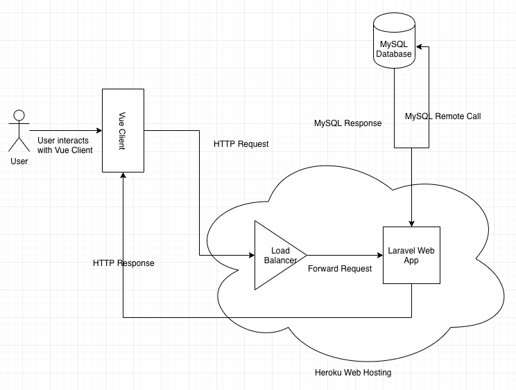

# Software Documentation
This document is mainly for the working developer to offer him a high level overview of the software stack we are running and also a chance for us techies to geek out :)

## Architectural Overview

As you can see we have kept it simple because the project was a standard web application at a relatively small scale (hundreds of users).
The normal work flow would entail a user interacting with the Vue client. The Vue client will initiate HTTP requests targeting our server URL https://sleepdiaryapp.herokuapp.com/api in order to give the user the appropriate displays and feedback. The requests first go through Heroku's load balancer which will forward the requests onto our Laravel web app. We will do some processing there and depending on the request, most likely make a database call. After that Laravel web app has finished its processing it will have a final output which will be sent back to the Vue Client as JSON. The Vue Client will take this JSON and display it back in a user friendly way for the user e.g. A bar graph. 

## Components
The following are all the important components that exist in our web application.

### Frontend
In modern web development this usually refers to what the user's browser displays. Browsers take in HTML, CSS and JS and generate a display back to the user to interact with. This display is what a user would call a website. However with the advent of Angular which inspired numerous other frontend frameworks to be developed, namely React and Vue the way content is delivered is a little more complicated. Instead of classic way where the server would generate the HTML, CSS, JS the frontend framework would do this instead. This is a fundamental shift in the way we deliver and write web applications because this moves a lot of the logic onto the client side.

This idea has taken over many large production websites now. Youtube uses Polymer, Facebook uses React, Airbnb uses React, Twitter uses React, Baidu uses Vue, Paypal uses Angular. Therefore it is important to understand why we would use a Frontend framework. Firstly it does make the development process more complicated **initially** with more setup, more libraries and frameworks to learn. But I have found that the code you right is much more *robust* because the framework forces you to structure your code and files in a readable and coherent manner. As a result there are less bugs, maintainability increases and the code base can scale as you add and remove team members.

#### Vue
This is the foundation of the frontend client which the user interacts with. The philosophy of Vue is to provide a simple, expressive and elegant way to write frontend web applications. The code located here: https://github.com/noobling/prof-comp/tree/master/website/client is written for the Vue framework 

#### Nuxt
Nuxt is another framework which is built on top of Vue. The main purpose of Nuxt is to help write *universal* applications. The main appeal of universal applications is the ability to have server side rendering, this solves the issue of poor SEO from frontend frameworks. In our case I decided to use Nuxt because it makes writing Vue apps easier, a lot of the boiler plate code is done and it has a structure already laid out for me. 

#### Vuetify
This is a styling library that provides web UI components designed following the material design philosophy by Google. I chose this because it makes the website look nice without a lot of coding and design required from me.

### Backend
In web development backend refers to all the code that does not exist on the users machine but instead it is in the cloud. 