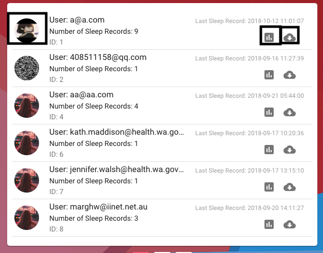

# User Manual
For Sleep Diary App - Some software to help you record your sleep. 

Located here: https://sleepdiaryapp.herokuapp.com

## Important information
* The app takes ~ 30 seconds to load sometimes because it is using a free website hosting service
* The app does not work on Internet Explorer because it is using modern web technologies to ensure it is future proof
* Do not refresh the app, instead open it up in a new window or tab or browser.

## Trouble shooting
Run through this list is something is not working.
- [ ] Don't user Internet Explorer
- [ ] Make sure to use this specific link: https://sleepdiaryapp.herokuapp.com
- [ ] Put a 0 in front your time/duration e.g. 06:03 pm
- [ ] Use landscape mode on your device
- [ ] Click on the "info" icon
- [ ] Open the application in a new window

## Getting Started
0. Navigate here: https://sleepdiaryapp.herokuapp.com
1. Register for an account by clicking the register button at the top
2. Create your first sleep record by clicking on "new sleep record"
4. Enter valid sleep data and click submit
5. Congratulations it was that easy!

## Researcher Mode
The image below shows the researcher mode available. It provides a view of all the patients in the database. Along with the features available outlined by the black boxes.
* Viewing a patient's sleep journal
* Viewing a patient's sleep graphs
* Downloading in excel format a patient's sleep journal

## Additional Features
Software is meant to improve the lives of people. Help us to discover information and insights that no one in history was able to.

* Data visualisation
* Password resets
* Data pre fill (no more lengthy forms!)
* Email invitations